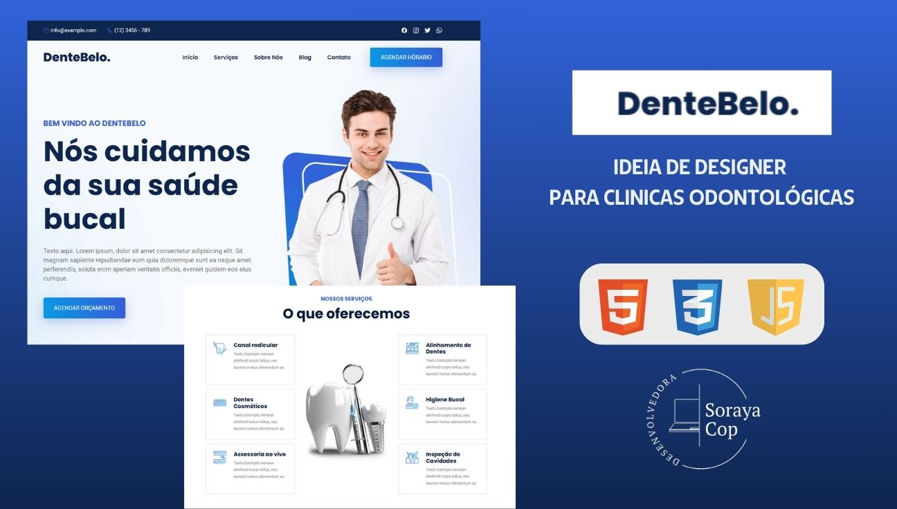

<h2 align="center">DenteBelo</h2>

DenteBelo é um site de simulação para consultórios dentários onde utilizo ferramentas para demostrar habilidades de FrontEnd em um site Estático.

<a href="https://sorayacop.github.io/dente-belo/"><strong>➥ Live Demo</strong></a>

 

 

### Screeshots

### Licença

Este projeto é **livre para usar** e não contém nenhuma licença.
